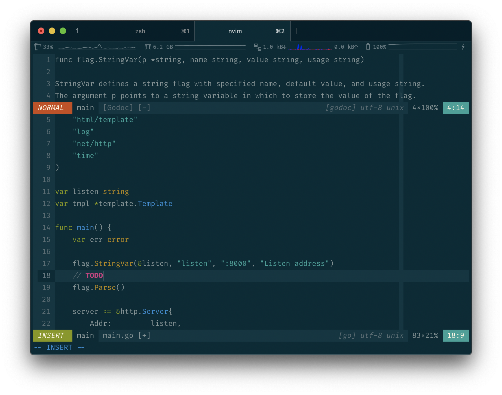
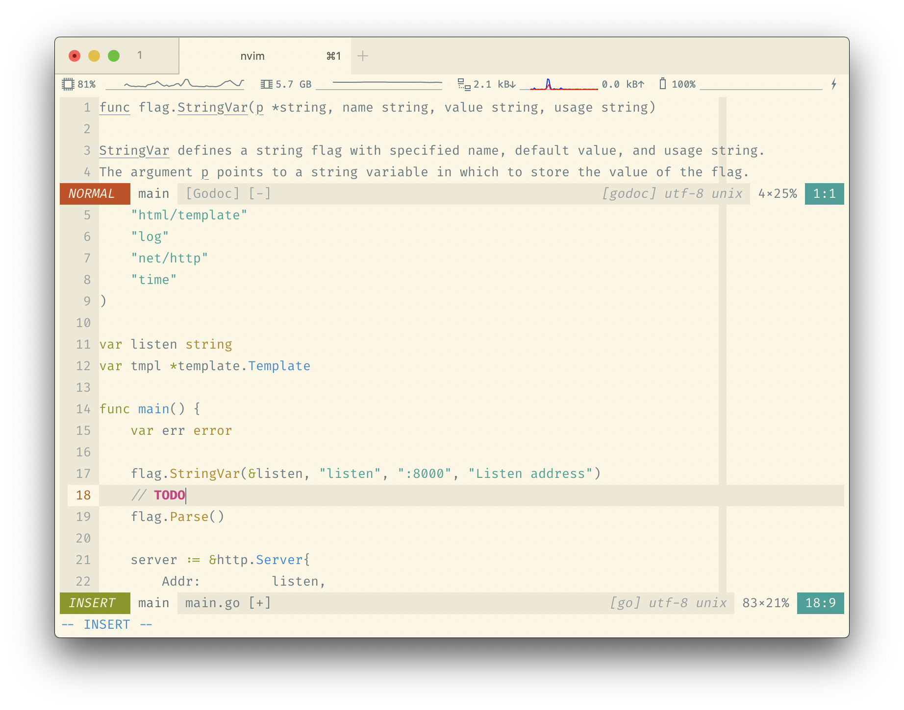
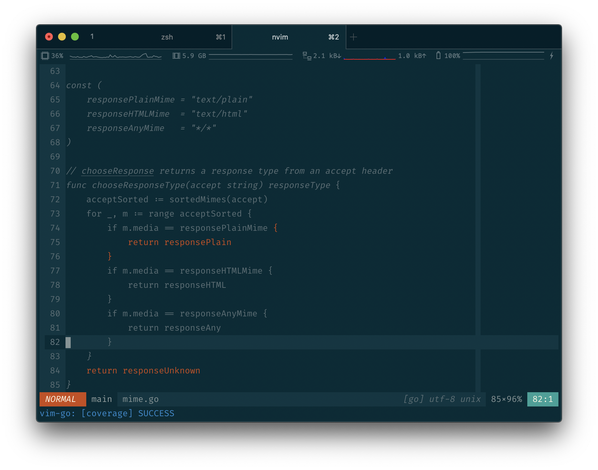
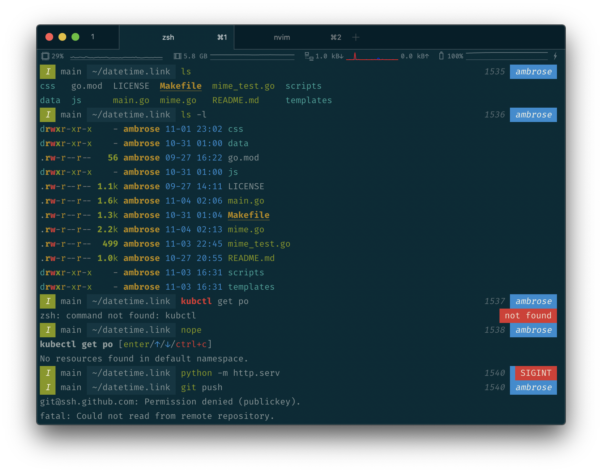
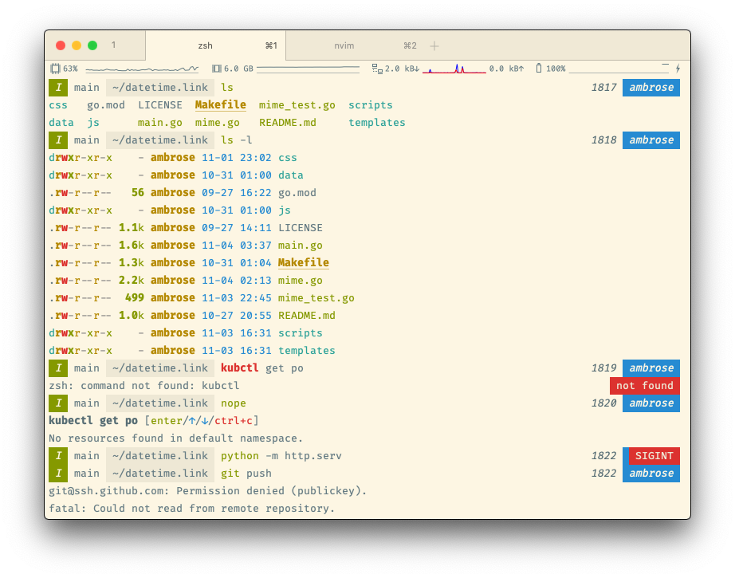

# env [](https://github.com/serverwentdown/env/actions/workflows/docker-publish.yml)

Just storing dotfiles in a repository isn't enough. This is almost all the tools I use, put into a Docker image that I can run anywhere

## Screenshots



## Usage

### Docker

```sh
export PATH="$HOME/.local/bin:$PATH"
curl -fLo ~/.local/bin/contain https://raw.githubusercontent.com/serverwentdown/env/master/.local/bin/contain
chmod +x ~/.local/bin/contain
contain -h
```

### macOS, Fedora, Alpine, Ubuntu, Debian

[Install yadm](https://yadm.io/docs/install), and then clone.

```sh
# Install yadm (macOS)
brew install yadm
# Install yadm (dirty method)
sudo curl -fLo /usr/local/bin/yadm https://github.com/TheLocehiliosan/yadm/raw/master/yadm
sudo chmod +x /usr/local/bin/yadm
# Clone
yadm clone git@github.com:serverwentdown/env.git
```

## Optional

```sh
git clone git@makerforce.io:ambrose/pass.git ~/.password-store
```
